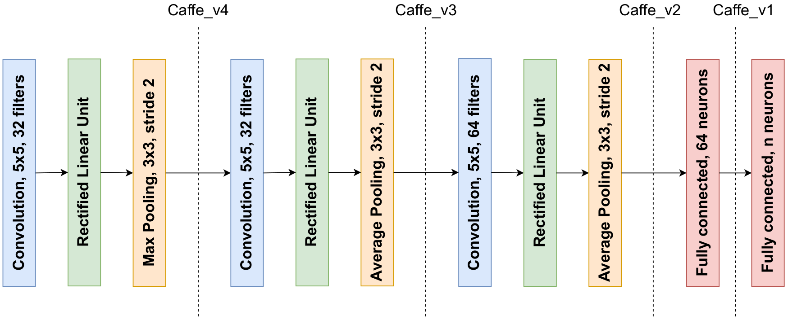

# Classification
### caffe_v1
Inspired from [here](https://github.com/BVLC/caffe/blob/master/examples/cifar10/cifar10_quick_train_test.prototxt), the split is before the last linear layer (116'256 weights for the feature extractor, 65 for each decision maker)

### caffe_v2
Same as caffe_v1 but with split before the linear layers (79'238 weights for the feature extractor, 36'993 for each decision maker)

### caffe_v3
Same as caffe_v1 but split after the two first conv block (28'064 weights for the feature extractor, 88'257 for each decision maker)

### caffe_v4
Same as caffe_v1 but split after the first conv block (2'432 weights for the feature extractor, 113'889 for each decision maker)



### caffe_large
Caffe_v1 but with one more linear layer, and doubling the number of filters in conv layers and units in linear ones

### vgg16_v1
Inspired from [here](https://iq.opengenus.org/vgg16/), the split is before the last 3 linear layers

### alexnet
Original architecture of AlexNet for image classification (https://en.wikipedia.org/wiki/AlexNet)


# Segmentation
### unet
Inspired from [here](https://medium.com/analytics-vidhya/unet-implementation-in-pytorch-idiot-developer-da40d955f201)
The different version modifies the position of the split

v0 -> split after the entire reconstruction, only one convolution in dm

v1 -> split before last 1 block of reconstruction

v2 -> split before last 2 blocks of reconstruction

v3 -> split before last 3 blocks of reconstruction

v4 -> split before last 4 blocks of reconstruction

```
                                      v4    v3     v2    v1       v0
                                      |     |      |      |        |
                                      |     |      |      |        |
  input ---> cnn ---------------------|-----|------|------|- tcnn -|--> output
                  cnn ----------------|-----|------|- tcnn
                       cnn -----------|-----|- tcnn
                            cnn ------|- tcnn
                                  cnn
```

  cnn = encoder block, based on Conv2d
  tcnn = decoder block, based on ConvTranspose2d


# Autoencoding
### aetest
Small autoencoder with convolutional blocks, meant to simply run the code, not for actual performance